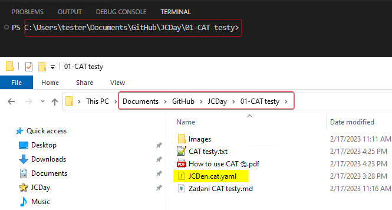
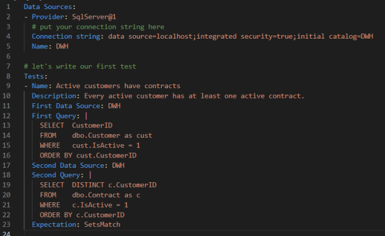

# CAT

To run CAT, it is necessary to have **Powershell 7**.

## 1. Where to Work with CAT
We recommend using Visual Studio Code with the YAML extension to create tests. 
In the Powershell command line in Visual Studio Code, navigate to the folder with the CAT file.



## 2. Creating Your First CAT Tests

Here is an example of the CAT project file:



You will define tests directly in the project file JCDen.cat.yaml. The file contains two parts: **Data Sources** and **Tests**.

### Data Sources
As you are writing tests for the database, you will be using SqlServer as the Provider, and there is a Connection string to the given database. In this case, the name is an alias for the Connection string, so you don't need to repeat it for each test. Therefore, only use the defined Name.

### Tests
Name: Choose a good name so that you can understand your intentions for the test.
Order: Simply the order of the tests.
Description: Describe what the test is doing.
First Data Source: Here is a place for the alias (Name) of the Connection string.
First Query: Place the test query here.
Expectation: SetIsEmpty, SetsMatch, or SetRowCount.

#### Explanation of the Expectation attribute:
SetIsEmpty: Expectation is zero rows (an empty set) as a test result.
SetsMatch: Expectation is the same results for both queries (you need to order the results if you compare text values).
SetRowCount: We can define the number of rows we expect to be returned.

#### Test attributes

TestSuite: optional
Order: optional
TestCase: optional
TestName: mandatory
Description: optional
FirstDataSource: mandatory
FirstQuery: mandatory
SecondDataSource: mandatory for integration tests (if you have Expectation **SetsMatch**)
SecondQuery: mandatory for integration tests (if you have Expectation **SetsMatch**)
Expectation: mandatory
Categories: optional
Tolerance: optional
Timeout: optional

#### Output: 
We can define test results output in the formats of trx, yaml, or json (at the end of the project file). It will generate a TestResults file in the folder next to your JCDen.cat.yaml project file.

## 3. Open and run your CAT tests

- To execute your tests, you need to first import the CAT module:

```
Import-module CAT 
```

- Then, open your project JCDen.cat.yaml using this command (but make sure to navigate to the folder with the CAT file in the command line first):

```
Open-CatProject 
```

- Once the project is loaded, you can run the tests:

```
Invoke-CatProject 
```

- Now, you can look for bugs and play with other CAT commands :)

## 4. Other CAT commands

You can use a variety of CAT commands, including:

```
Close-CatProject                                 
Get-CatDataSource                              
Get-CatDataSourceList                           
Get-CatProject                                 
Get-CatSession                                    
Get-CatTest                                      
Get-CatTestList                                    
Get-CatTestResult                                 
Get-CatTestResultSummary                           
Invoke-CatProject                                 
Invoke-CatTest                                     
New-CatProject                                     
Open-CatProject                                    
Show-CatProject                                    
Show-CatTestResultSummary  	
```

To view all the commands, you can try and experiment with this:
```
Get-Command -Module CAT
```

For example, if you want to filter failed tests with more detailed output, you can use this command:
```
Get-CatTestResult | ? { $_.TestResult -eq 'Failed'}
```