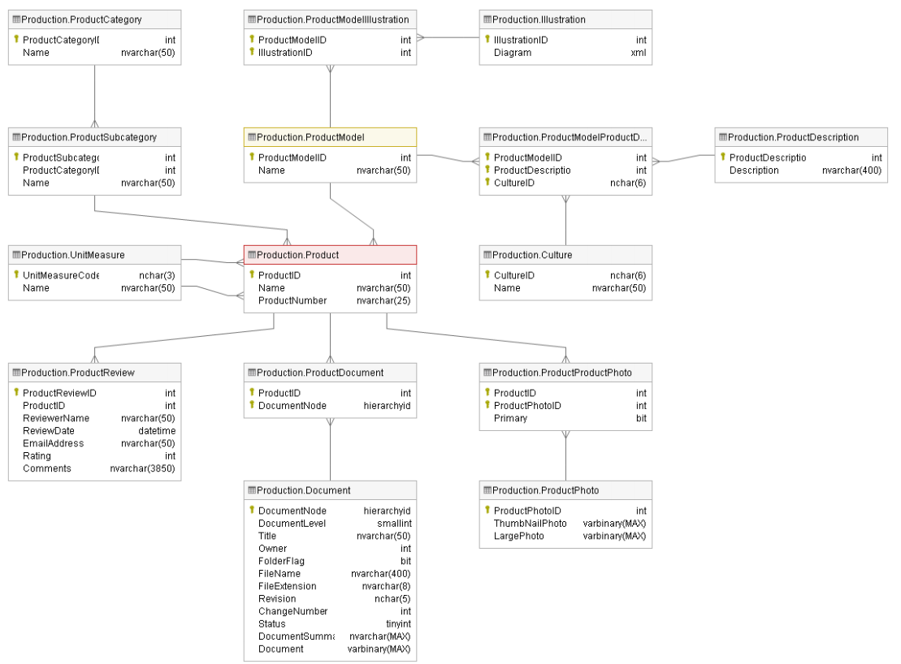

# Adventure Works Cycles - Production

## CAT testy

Pracujeme s databázemi AdventureWorks2019 a AdventureWorksDW2019, které shromažďují data o fiktivním nadnárodním výrobci jízdních kol Adventure Works Cycles, a s Power BI reportem DQaaS Lab, který používá CEO, šéf oddělení produkce a developerský tým.

Data je potřeba kontrolovat, protože jsou na jejich základě tvořena důležitá byznysová rozhodnutí. Klíčoví stakeholdeři a šéfové oddělení produkce sepsali pro QA základní požadavky, které data musí splňovat.

V části A jsou sepsány požadavky na Smoke testy, v části B jsou požadavky na integrační testy pro tabulky v databázi AdventureWorks2019 a tabulky v databázi AdventureWorksDW2019.

Na konci dokumentu můžete najít informace o tabulkách v AdventureWorks2019.

## A)  Smoke testy

| Testovací požadavek | Název tabulky v databázi AdventureWorks2019 | Query |
| --- | --- | --- |
| Hodnoty ve sloupci SafetyStockLevel nesmí obsahovat hodnotu 0 nebo NULL | [Production].[Product] | |
| Hodnota ve sloupci StandardCost nesmí být větší než hodnota ve sloupci ListPrice | [Production].[Product] | |
| Datum ve sloupci SellStartDate nesmí být starší než 1.1.2000|[Production].[Product]| |
| Hodnota ve sloupci TransactionType musí obsahovat pouze hodnoty W, S nebo P|[Production].[TransactionHistory] | |

## B)  Integrační testy

| Testovací požadavek | Tabulka v AdventureWorks2019 | Tabulka v AdventureWorksDW2019 | Query AdventureWorks2019 | Query AdventureWorksDW2019 |
|---|---|---|---|---|
| Hodnoty Name v tabulce Product musí být stejné jako v tabulce DimProduct | [Production].[Product] | [dbo].[DimProduct] |  |  |
| Každý produkt z tabulky DimProduct musí mít záznam v tabulce FactProductInventory| - | 1. [dbo].[DimProduct],   2. [dbo].[FactProductInventory] | - |  |
| Celková suma za každý produkt v tabulce SalesOrderHeader se musí rovnat celkové sumě v tabulce FactInternetSales | [Sales].[SalesOrderHeader] | [dbo].[FactInternetSales] | | |

 

### Přehled tabulek za oddělení Production v databázi AdventureWorks2019
  |Název tabulky | Stručný popis |
  |---|---|
  |Production.Culture                                 |Lookup table containing the languages in which some AdventureWorks data is stored.
  |Production.Document                                |Product maintenance documents.
  |Production.Illustration                            |Bicycle assembly diagrams
  |Production.Product                                 |Products sold or used in the manufacturing of sold products.
  |Production.ProductCategory                         |High-level product categorization.
  |Production.ProductDescription                      |Product descriptions in several languages.
  |Production.ProductDocument                         |Cross-reference table mapping products to related product documents.
  |Production.ProductModel                            |Product model classification.
  |Production.ProductModelIllustration                |Cross-reference table mapping product models and illustrations.
  |Production.ProductModelProductDescriptionCulture   |Cross-reference table mapping product descriptions and the language the description is written in.
  |Production.ProductPhoto                            |Product images.
  |Production.ProductProductPhoto                     |Cross-reference table mapping products and product photos.
  |Production.ProductReview                           |Customer reviews of products they have purchased.
  |Production.ProductSubcategory                      |Product subcategories. See ProductCategory table.
  |Production.UnitMeasure                             |Unit of measure lookup table.

 

### Schéma tabulek v databázi AdventureWorks2019

